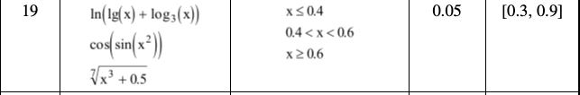
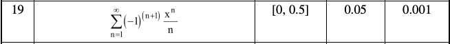

## Лабораторні роботи з дисципліни "Алгоритмізація та програмування"

## Виконав: Попов Юрій Андрійович(ІР-13)
## Лабораторна робота №2 (Варіант 19)
_______________________________________________
### Завдання 1:

### Завдання 2:
