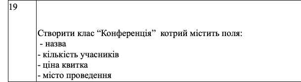

## Лабораторні роботи з дисципліни "Алгоритмізація та програмування"
## Виконав: Попов Юрій Андрійович(ІР-13)
## Лабораторна робота №4 (Варіант 19)

### Завдання:
1.     Вивчити поняття модифікаторів видимості, конструкторів та деструкторів мови Python
2.     Написати файл для представлення сутності з таблиці за допомогою класу мови Python.
3.     Поля, вказані в таблиці, мають бути приватними.
4.     Для кожного приватного поля слід реалізувати методи доступу до даних (наприклад для поля name – getName())
5.     Перевизначити методи __str__ та __repr__.
6.     Для кожного класу слід додати 2 публічні поля, одне з яких має бути числового типу, а друге – стрічкового.
7.     Для кожного класу слід створити конструктор по замовчуванню та конструктор, котрий приймає та виконує ініціалізацію всіх приватних та захищених полів.
8.     Для кожного класу слід оголосити та реалізувати деструктор.
9.     Написати main метод, в якому здійснити ініціалізацію 3 об’єктів заданого класу та реалізувати виведення значень всіх полів.

### Таблиця:
